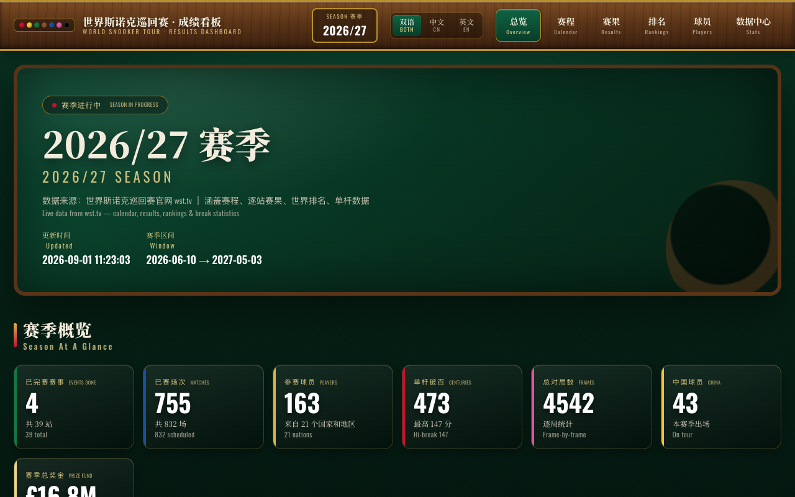
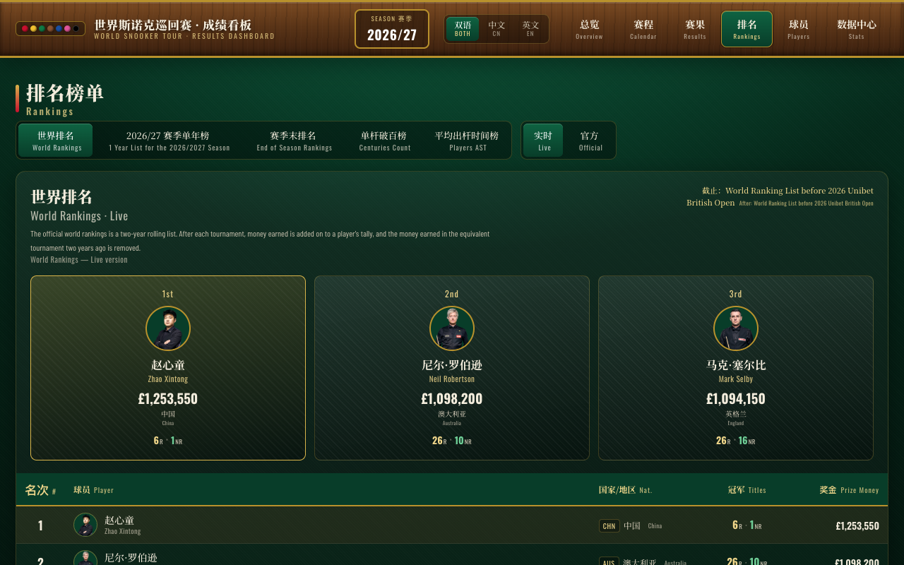

# 2026/27 世界斯诺克巡回赛 · 成绩看板

> World Snooker Tour (WST) 2026/27 Season Dashboard — 中英双语、纯静态、自动追更。

🔗 **在线看板**：https://moonquake2004.github.io/snooker-dashboard/
（镜像：https://62bc7128a2ae4219b3efe717d76505db.app.workbuddy.link ）

[](https://github.com/moonquake2004/snooker-dashboard/stargazers)
[](LICENSE)
[](.github/workflows/refresh.yml)




---

## 它能看什么

| 模块 | 内容 |
| --- | --- |
| 赛季总览 | 已完赛/进行中/未开始赛事数、赛季完赛场次、破百总数、赛季总奖金 |
| 赛程赛果 | 全部赛事的对阵表，进行中赛事实时跟进比分与晋级树 |
| 世界排名 | 官方排名 + 球员生涯冠军数（排名赛 / 非排名赛拆分，数据源 CueTracker） |
| 数据榜 | 破百榜、奖金榜、胜场榜、决胜局榜等领跑者 |
| 历史冠军榜 | 现役球员生涯冠军一览，中英双语，移动端自适应 |

* 中英双语显示（球员名、赛事名、场馆名）
* 响应式：桌面 / iPad / 手机三档布局均已适配
* 无任何后端、无数据库、无第三方 JS 依赖，打开即加载完数据

## 数据来源

* **赛程 / 赛果 / 排名 / 破百**：World Snooker Tour 官方公开 JSON:API（`*.snooker.web.gc.wstservices.co.uk/v2/`），即 wst.tv 官网所使用的数据接口
* **生涯冠军数**：[CueTracker](https://www.cuetracker.net/)（best-effort 抓取，被限流时沿用上次结果）
* **球员头像**：WST 官方图片 CDN

数据版权归 World Snooker Tour 及 CueTracker 所有，本项目仅做聚合展示，为非商业性质的爱好者作品。

## 自动更新

仓库内置 GitHub Actions（`.github/workflows/refresh.yml`）：每天 **北京时间 22:00** 自动抓取最新数据、校验、提交。赛事进行期间打开看板即为当天最新结果。

也可在仓库 Actions 页面手动点 `Run workflow` 立即刷新。

## 本地运行

只依赖 Python 3 标准库，无需安装任何包。

```bash
git clone https://github.com/moonquake2004/snooker-dashboard.git
cd snooker-dashboard

# 轻量刷新：只抓进行中赛事的比赛与赛程（约 1 分钟，推荐日常使用）
./refresh_live.sh

# 完整刷新：含奖金页、生涯冠军、排名、球员（约 10 分钟）
./refresh.sh

# 本地预览
python3 -m http.server 8848
# 浏览器打开 http://127.0.0.1:8848
```

## 目录结构

```
index.html                 单页看板（结构 + 文案）
assets/css/style.css        样式（含三档响应式）
assets/js/app.js            渲染逻辑，读取 data/dashboard.json
data/dashboard.json         构建产物：看板所需的全部聚合数据
data/raw/                   抓取缓存（大文件已 gitignore）
scripts/
  fetch_data.py             抓 WST JSON:API（支持 --concurrency 并发翻页）
  fetch_prize.py            抓赛事奖金页
  fetch_titles.py           抓 CueTracker 生涯冠军
  build_dashboard.py        清洗 + 按赛季过滤 + 聚合 → dashboard.json
  translations.py           中英对照词典
  tournament_meta.py        赛事元信息
  title_board.py            历史冠军榜聚合
.github/workflows/refresh.yml  每日自动刷新
```

## 已知口径说明

* WST 接口 `filter[...]` 参数不生效，需全量拉取后在本地按赛季过滤；分页参数必须用 `page.number=N`（点号），写成 `page[number]` 会被忽略导致只拿到第一页。
* 「冠军联赛」赛季内有两站同名赛事，赛季初站为排名赛、赛季中站为邀请赛，CueTracker 分类正确。
* 单局限时赛自 2017/18 赛季起为排名赛。

## License

MIT — 代码可自由使用；数据版权归原数据方所有。
